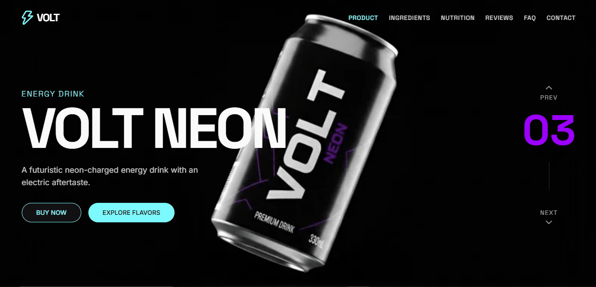
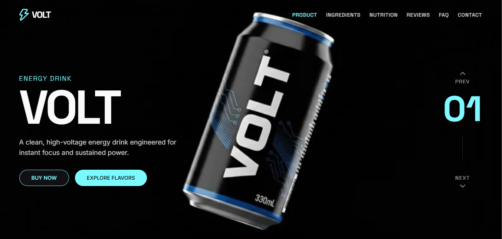
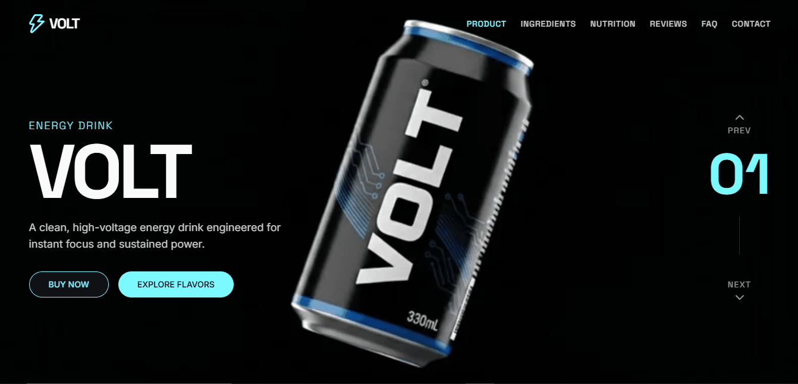
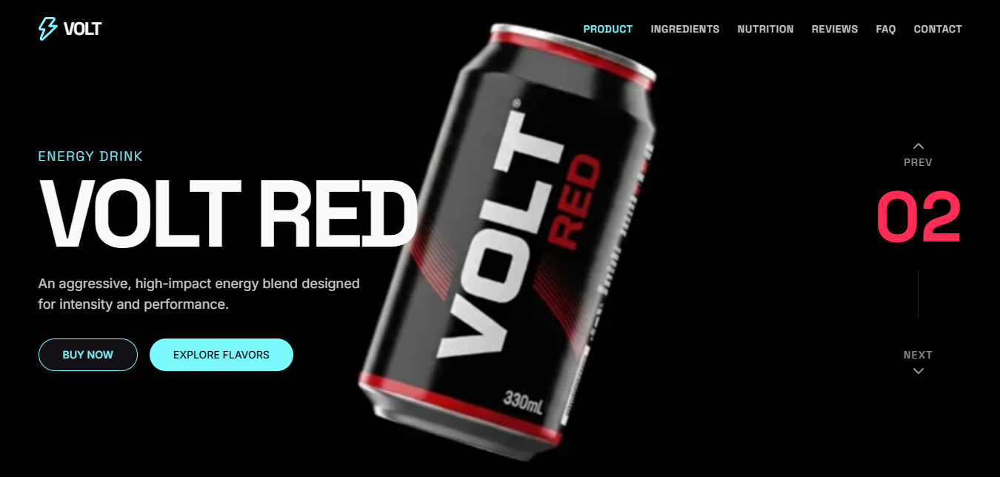
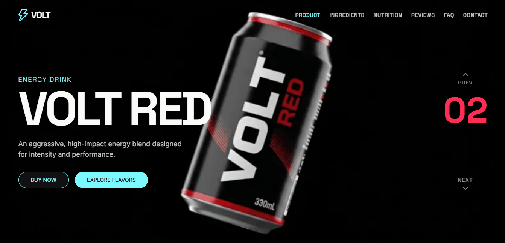

<div align="center">
  

  <h1>⚡ VOLT — Cinematic Parallax Energy Drink Website</h1>
  
  <p>
    <strong>A high-performance, scroll-driven parallax website built to showcase a fictional energy drink brand using cinematic WebP frame sequences, smooth variant switching, and modern frontend tooling.</strong>
  </p>
  
  <p>
    
    
    
    
    
  </p>
</div>

<hr />

## ✨ Features

- **Scroll-Controlled Cinematic Hero**
  - Full-screen parallax background driven by WebP frame sequences.
  - Scroll down → animation advances.
  - Scroll up → animation reverses.
  - Smooth, non-time-based motion tied directly to physical scroll position.

- **High-Performance Asset Delivery**
  - WebP frame sequences hosted externally on Supabase Storage (CDN-backed).
  - Lazy loading + progressive preloading to avoid blocking renders.

- **Premium UI / UX**
  - Dark cinematic aesthetic built to frame high-fidelity imagery.
  - Minimal UI to keep focus purely on motion and product.
  - Smooth fade transitions between variants.

---

## 🥤 Multiple Drink Variants

VOLT dynamically shifts its entire theme and parallax sequence based on the active flavor variant.

<div align="center">
  <table>
    <tr>
      <td align="center">
        <h3>VOLT Blue</h3>
        <br/>
        
      </td>
      <td align="center">
        <h3>VOLT Neon</h3>
        <br/>
        
      </td>
      <td align="center">
        <h3>VOLT Red</h3>
        <br/>
        
      </td>
    </tr>
  </table>
</div>

---

## 🧠 Technical Architecture

### Scroll → Frame Mapping
Instead of autoplaying a massive video file, the hero animation maps **scroll position → frame index**, giving absolute tactile control over the motion while saving massive amounts of memory and bandwidth.

```text
scrollProgress → normalized value → frameIndex → WebP frame
```

**Why this approach?**
- Feels physically tactile and responsive (unlike a video player).
- Bypasses heavy video decoding overhead on mobile devices.
- Gives full programmatic control over animation timing and snapping.

---

## 🗂️ Project Structure

```text
src/
├─ app/
│  ├─ layout.tsx
│  ├─ page.tsx
│  └─ globals.css
│
├─ components/
│  ├─ hero-section.tsx
│  ├─ parallax-background.tsx
│  ├─ loading-screen.tsx
│  ├─ header.tsx
│  ├─ footer.tsx
│  └─ sections/
│     ├─ about-section.tsx
│     ├─ ingredients-section.tsx
│     ├─ nutrition-section.tsx
│     ├─ reviews-section.tsx
│     └─ faq-section.tsx
│
├─ lib/
│  ├─ drink-variants.ts
│  ├─ placeholder-images.ts
│  └─ utils.ts
```

---

## 🚀 Local Development

```bash
# install dependencies
npm install

# run dev server
npm run dev
```

Open `http://localhost:3000` to view the application.

---

## 🌐 Deployment

Deployed using **Vercel** with automatic CI/CD from GitHub.

1. Push the repository to GitHub.
2. Import the project in Vercel.
3. Add environment variables from `.env`.
4. Deploy.

---

## 📌 Purpose of This Project

This project explores how **image-sequence–driven motion**, **scroll-mapped animation**, and high-quality asset design can be combined into a production-ready marketing site. It is not a template dump — it is an engineered motion system.
